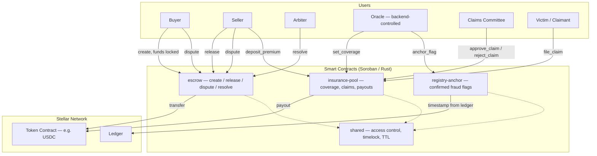
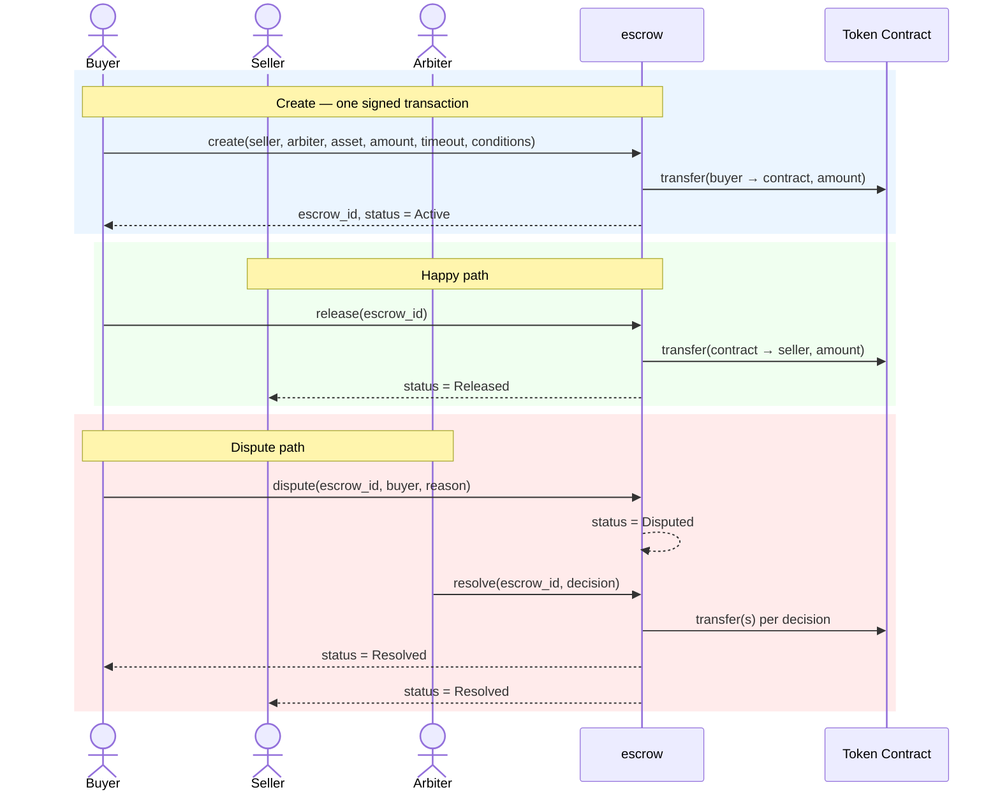

# Astraguard Contracts

[](https://github.com/Astraguard/Contracts/actions/workflows/contract-ci.yml)

Soroban smart contracts for Astraguard, the trust and safety layer for Stellar: conditional payment escrow with dispute resolution, an insurance pool that backs verified projects with real coverage, and a registry anchor that timestamps confirmed fraud flags on-chain for public auditability.

This repository is the **on-chain layer only**: escrow, insurance pool, and registry anchor contracts. Off-chain verification, scoring, and any dashboard/frontend are out of scope here.

## Overview

Astraguard's contracts give the Stellar ecosystem safety primitives that rarely exist on-chain: payments that only release when a condition is actually met (or an arbiter says otherwise), capital-backed insurance for projects that pass off-chain verification, and a public, immutable record of confirmed fraud that any wallet or protocol can check before trusting a counterparty.

Every privileged write — coverage decisions, fraud flags — is gated to a single oracle address; nothing in these contracts trusts off-chain data except through that one authorized account.

## Features

- **Conditional Escrow**: Funds lock on `create` and release to the seller once the buyer confirms, the timeout passes, or a dispute is resolved
- **Dispute Resolution**: Either the buyer or the seller can raise a dispute; the escrow's designated arbiter issues a binding decision — including a partial split
- **Insurance Pool**: Premiums fund a shared pool; the oracle grants coverage to verified projects within a solvency-ratio cap, and a claims committee approves or rejects payouts
- **Registry Anchor**: Confirmed fraud flags are timestamped from the ledger clock (not caller-supplied) and anchored permanently, with lookups by subject
- **Timelocked Admin Handover**: Every contract's admin can only be changed via a 48-hour propose → accept flow, so a compromised or malicious admin key can't take effect silently
- **TTL-Managed Storage**: Every write to persistent storage bumps that entry's TTL, and every state-changing call bumps the contract instance's TTL, so escrows/claims/flags don't silently expire off the ledger

## Repository Layout

```
astraguard-contracts/
├── contracts/
│   ├── shared/            # astraguard-shared: access control, timelock, TTL helpers
│   │   └── src/{access,timelock,ttl}.rs
│   ├── escrow/             # Conditional payment escrow
│   │   └── src/{lib,test}.rs
│   ├── insurance-pool/     # Premiums, coverage, claims, payouts
│   │   └── src/{lib,test}.rs
│   └── registry-anchor/    # On-chain anchor of confirmed fraud flags
│       └── src/{lib,test}.rs
├── scripts/
│   ├── build.sh             # cargo build + stellar contract optimize, all contracts
│   └── deploy.sh             # deploy all three to a given network, record IDs
├── deployments/
│   ├── testnet.json          # contract IDs per network, filled in by deploy.sh
│   └── mainnet.json
├── tests/README.md          # scope for future cross-contract integration tests
└── Cargo.toml                # Rust workspace
```

## Architecture



### Core Components

- **`contracts/escrow`**: Locks buyer funds, releases to the seller on confirmation/timeout, and settles arbiter decisions on disputes
- **`contracts/insurance-pool`**: Collects premiums, tracks per-project coverage under a solvency-ratio cap, and runs claims through committee approval before payout
- **`contracts/registry-anchor`**: Oracle-only append of confirmed fraud flags, hashed and timestamped, queryable by subject
- **`contracts/shared`** (`astraguard-shared`): Common admin/oracle access control (`access.rs`), the timelocked admin-handover flow (`timelock.rs`), and TTL-bump helpers (`ttl.rs`) used by all three contracts

### Escrow Split Model

Outcomes enforced on-chain once an arbiter resolves a dispute (`Decision`):

| Decision              | Seller      | Buyer      |
|------------------------|------------|------------|
| No dispute (`release`) | 100%       | 0%         |
| `ReleaseToSeller`       | 100%       | 0%         |
| `RefundToBuyer`         | 0%         | 100%       |
| `Split(seller_bps)`     | `seller_bps` / 10000 | remainder |

## Tech Stack

| Component        | Technology                | Purpose                                                         |
|-------------------|---------------------------|-------------------------------------------------------------------|
| Smart Contracts   | Rust + Soroban SDK 26     | Escrow, insurance pool, registry anchor                           |
| Asset Settlement  | Any Soroban token contract (e.g. Stellar USDC) | Escrow funding, premiums, insurance payouts       |
| Wallet / Auth     | Freighter Wallet (via the frontend repo) | Signs buyer/seller/arbiter/committee transactions   |
| Off-chain Indexing| Contract events           | Consumed by the backend indexer, not by this repo                 |

## Smart Contract Functions

### `escrow`

- `initialize(admin)` — one-time setup
- `create(buyer, seller, arbiter, asset, amount, timeout, conditions)` — locks `amount` of `asset` from `buyer`; `conditions` is the hash of an off-chain terms document
- `release(escrow_id)` — buyer-authorized any time, or permissionless once `timeout` has passed
- `dispute(escrow_id, caller, reason)` — `caller` must be the buyer or seller
- `resolve(escrow_id, decision)` — arbiter-only, binding
- `get_escrow(escrow_id)` — full record and status
- `propose_admin(candidate)` / `accept_admin()` — timelocked admin handover

### `insurance-pool`

- `initialize(admin, oracle, asset, coverage_ratio_bps, committee, approval_threshold)`
- `deposit_premium(from, project, amount)` — funds flowing into the pool
- `set_coverage(project, status, amount)` — **oracle-only**; rejected if it would push total active coverage past `coverage_ratio_bps` of the pool's balance
- `file_claim(project, victim, amount, evidence_hash)` — requires the project to have `Active` coverage
- `approve_claim(claim_id, member)` — committee member vote; claim becomes payable once `approval_threshold` distinct members have approved
- `reject_claim(claim_id, member)` — any single committee member can reject a still-`Filed` claim
- `payout(claim_id)` — disburses an `Approved` claim from pooled capital
- `get_coverage(project)`, `get_claim(claim_id)`, `pool_balance()` — queries
- `propose_admin(candidate)` / `accept_admin()`

### `registry-anchor`

- `initialize(admin, oracle)`
- `anchor_flag(subject, record_hash, category)` — **oracle-only**; timestamp is taken from the ledger clock, not a caller-supplied argument, so flags can't be backdated; returns `flag_id`
- `supersede_flag(flag_id, reason_hash)` — **oracle-only**; marks a previously anchored flag as retracted/corrected without deleting the original record (tamper-evidence is preserved). `reason_hash` is the hash of the off-chain correction document. Returns the written `Supersession`. Errors with `AlreadySuperseded` if called twice on the same flag.
- `get_flag(flag_id)` — returns the raw `Flag`; does **not** indicate supersession on its own
- `get_supersession(flag_id)` — returns `Some(Supersession)` if the flag has been retracted, `None` if it is still live
- `get_flag_with_supersession(flag_id)` — preferred query; returns `FlagWithSupersession { flag, supersession }` so consumers can distinguish live from retracted in a single call
- `get_flags_for_subject(subject)` — returns all flag ids ever anchored against `subject`, including superseded ones; call `get_flag_with_supersession` on each id and filter out those with a non-`None` supersession to see only live flags
- `propose_admin(candidate)` / `accept_admin()`

## Escrow Lifecycle — Sequence Diagram



## Escrow Lifecycle — State Machine

`EscrowStatus`, enforced by `contracts/escrow/src/lib.rs`:

```
┌────────┐
│ Active │  ← create() locked funds; buyer or seller may act
└───┬────┘
    │
    ├─────────────────────┐
    │                      │
    ▼                      ▼
┌──────────┐         ┌──────────┐
│ Released │         │ Disputed │  ← buyer or seller called dispute()
└──────────┘         └────┬─────┘
 (terminal)                │
                           ▼
                     ┌──────────┐
                     │ Resolved │  ← arbiter called resolve() (terminal)
                     └──────────┘
```

### Valid Transitions

| From      | To        | Trigger                                                        |
|-----------|-----------|------------------------------------------------------------------|
| Active    | Released  | Buyer calls `release`, or anyone after `timeout`                 |
| Active    | Disputed  | Buyer or seller calls `dispute`                                   |
| Disputed  | Resolved  | Arbiter calls `resolve` — funds move per `Decision`                |

## Insurance Claim Lifecycle

`ClaimStatus`, enforced by `contracts/insurance-pool/src/lib.rs`:

```
Filed ──approve_claim (≥ threshold)──▶ Approved ──payout──▶ PaidOut
  │
  └──reject_claim (any 1 committee member)──▶ Rejected (terminal)
```

## Security Features

1. **Escrow Fund Isolation**: Each escrow's funds and status are tracked independently — no commingling across buyers or sellers
2. **Arbiter/Committee-Gated Actions**: `resolve` requires the specific escrow's arbiter; `set_coverage`/`anchor_flag` require the oracle; `approve_claim`/`reject_claim` require committee membership — all enforced via `require_auth`, not just a convention
3. **Atomic Settlement**: Release, dispute-split, and claim payouts move funds in the same transaction as the state transition — no partial payouts
4. **Solvency Guard**: `insurance-pool` rejects new active coverage that would push total exposure past `coverage_ratio_bps` of the pool's actual token balance
5. **Immutable Registry**: Anchored fraud flags cannot be edited or deleted once confirmed; timestamps come from the ledger clock, not the caller. If the oracle anchors a flag in error, `supersede_flag` attaches a `Supersession` record alongside the original without touching it — the original entry remains on-chain for tamper-evidence, while the supersession signals to consumers that the flag has been retracted
6. **Timelocked Admin Handover**: Admin changes require a `propose_admin` → 48h wait → `accept_admin` flow on every contract (`astraguard-shared::timelock`)
7. **TTL Extension**: Every persistent write and every state-changing call bumps storage TTL (`astraguard-shared::ttl`) so live data doesn't expire off the ledger between accesses
8. **Checks-Effects-Interactions**: `escrow::release`/`resolve` and `insurance-pool::payout` write settled state (status, TTL, coverage totals) before invoking the token contract's `transfer`, not after — a panicking or malicious `asset` contract can't reenter to see (or exploit) stale `Active`/`Approved` state, and a failed transfer still rolls back the whole call in Soroban, so this costs nothing on the success path

**Known gaps, called out rather than hidden:** `arbiter`, `oracle`, and each committee member are currently single Stellar addresses, not on-chain multisig accounts — a real multisig/timelock behind each of those roles is real work before mainnet. There's also no pause/circuit-breaker function; none is implemented, so none is claimed here. TTL threshold/bump constants in `ttl.rs` are reasonable starting values, not tuned against a specific network's rent-fee economics yet. `env.events().publish(...)` is deprecated in favor of the `#[contractevent]` macro (soroban-sdk 26); migrating changes the on-chain event encoding, so it's left as a deliberate follow-up rather than a drive-by rename — see Roadmap.

## Quick Start

Requires a Rust toolchain with the `wasm32v1-none` target (see `rust-toolchain.toml`) and the [`stellar` CLI](https://developers.stellar.org/docs/tools/stellar-cli).

### 1. Build and test

```bash
cargo test --workspace
./scripts/build.sh
```

`scripts/build.sh` builds all three contracts for `wasm32v1-none` and runs `stellar contract optimize` on each.

### 2. Deploy

```bash
./scripts/deploy.sh testnet <source-account>
```

This deploys `escrow`, `insurance-pool`, and `registry-anchor` and writes their contract IDs to `deployments/testnet.json`. It does **not** call `initialize` — each contract's constructor arguments (admin, oracle, asset, committee, ...) depend on addresses specific to your deployment.

### 3. Initialize each contract

```bash
stellar contract invoke --id <ESCROW_ID> --source <source-account> --network testnet \
  -- initialize --admin <ADMIN_ADDRESS>

stellar contract invoke --id <INSURANCE_POOL_ID> --source <source-account> --network testnet \
  -- initialize --admin <ADMIN_ADDRESS> --oracle <ORACLE_ADDRESS> --asset <TOKEN_ADDRESS> \
     --coverage_ratio_bps 5000 --committee '[<MEMBER_1>,<MEMBER_2>]' --approval_threshold 2

stellar contract invoke --id <REGISTRY_ANCHOR_ID> --source <source-account> --network testnet \
  -- initialize --admin <ADMIN_ADDRESS> --oracle <ORACLE_ADDRESS>
```

## How It Works

1. **Escrow** — Buyer calls `create`; funds lock in one signed transaction. Seller (or anyone, post-timeout) calls `release` for the happy path. Either party can `dispute`; the arbiter's `resolve` call is final and moves funds per its `Decision`.
2. **Insurance** — Premiums accumulate via `deposit_premium`. The oracle (driven by the backend's trust-score service) grants `Active` coverage via `set_coverage`, capped by the solvency guard. A victim files a claim; the claims committee reaches `approval_threshold` via `approve_claim` (or any member can `reject_claim`); an approved claim is disbursed via `payout`.
3. **Registry** — Once the backend's two-person review confirms a fraud report, the oracle calls `anchor_flag`. The hash and ledger timestamp are permanent; anyone can call `get_flags_for_subject` before trusting an address. If a flag was anchored in error, the oracle calls `supersede_flag` — the original record stays on-chain for tamper-evidence and a `Supersession` is attached alongside it. Consumers should use `get_flag_with_supersession` to distinguish live flags from retracted ones.

## Testing

```bash
cargo test --workspace
```

Current unit test coverage, per contract (`contracts/<name>/src/test.rs`):
- **escrow**: create + happy-path release; dispute → arbiter split resolution; non-party cannot dispute
- **insurance-pool**: premium deposit → coverage → claim → committee approval → payout; coverage rejected beyond the solvency ratio; committee member rejection of a filed claim; non-committee members can't approve or reject
- **registry-anchor**: anchor + query a flag by id and by subject; multiple flags accumulate per subject; `supersede_flag` happy path, idempotency guard (`AlreadySuperseded`), and unknown-flag guard (`FlagNotFound`); `get_flag_with_supersession` returns live vs retracted state correctly

Not yet covered: cross-contract integration scenarios (see `tests/README.md`), and this test suite has not been run against a live Rust/Soroban toolchain in this environment — verify with `cargo test --workspace` before relying on it.

## MVP Scope

The initial testnet MVP focuses on a single end-to-end flow:

1. Buyer creates and funds an escrow for a seller under a defined condition
2. Seller receives funds on release, or either party raises a dispute for the arbiter to resolve

Insurance pool and registry anchor are scaffolded and unit-tested but not yet wired into a real backend oracle or a real multisig committee.

## Roadmap

- [x] Conditional escrow (`create` / `release` / `dispute` / `resolve`) with a full state machine and unit tests
- [x] Insurance pool with solvency-capped coverage, claim approval/rejection, and payout
- [x] Registry anchor for confirmed fraud flags
- [x] Oracle-only `supersede_flag` for retraction-without-deletion (tamper-evidence preserved)
- [x] Timelocked admin handover and persistent-storage TTL management on all three contracts
- [x] CI: build + test on every push/PR
- [x] Checks-effects-interactions ordering on all fund-transferring calls (`escrow::release`/`resolve`, `insurance-pool::payout`)
- [ ] Migrate event emission from `env.events().publish(...)` to the `#[contractevent]` macro
- [ ] Replace single-address `arbiter`/`oracle`/committee members with real multisig accounts
- [ ] Cross-contract integration tests (see `tests/README.md`)
- [ ] Validate TTL threshold/bump constants against target network rent economics
- [ ] External audit
- [ ] Mainnet launch

## Dependencies

- `soroban-sdk = "26.1.0"` — Soroban smart contract SDK (the only external dependency; see `Cargo.toml`)

## Error Codes

### `escrow`

| Code | Error | Cause |
|------|-------|-------|
| 1 | `AlreadyInitialized` | `initialize` called twice |
| 2 | `EscrowNotFound` | Invalid or unknown `escrow_id` |
| 3 | `InvalidAmount` | `amount <= 0` in `create` |
| 4 | `InvalidTimeout` | `timeout` is not in the future |
| 5 | `NotParty` | `dispute` caller is neither buyer nor seller |
| 6 | `AlreadySettled` | `release`/`dispute` called on a non-`Active` escrow |
| 7 | `NotDisputed` | `resolve` called on an escrow that isn't `Disputed` |
| 8 | `InvalidSplit` | `Decision::Split` basis points > 10000 |

### `insurance-pool`

| Code | Error | Cause |
|------|-------|-------|
| 1 | `AlreadyInitialized` | `initialize` called twice |
| 2 | `ProjectNotCovered` | `file_claim` against a project without `Active` coverage |
| 3 | `ClaimNotFound` | Invalid or unknown `claim_id` |
| 4 | `InvalidAmount` | Non-positive amount in `deposit_premium`/`file_claim`, or negative `set_coverage` amount |
| 5 | `CoverageExceedsSolvency` | New active coverage would exceed `coverage_ratio_bps` of the pool balance |
| 6 | `NotCommitteeMember` | `approve_claim`/`reject_claim` caller isn't in the committee |
| 7 | `ClaimNotApproved` | `payout` called on a claim that isn't `Approved` |
| 8 | `ClaimAlreadySettled` | `approve_claim`/`reject_claim` called on a claim that isn't `Filed` |
| 9 | `InsufficientPoolBalance` | `payout` amount exceeds the pool's current token balance |

### `registry-anchor`

| Code | Error | Cause |
|------|-------|-------|
| 1 | `AlreadyInitialized` | `initialize` called twice |
| 2 | `FlagNotFound` | Invalid or unknown `flag_id` in any flag query or `supersede_flag` |
| 3 | `AlreadySuperseded` | `supersede_flag` called on a flag that has already been superseded |

## Events

| Contract | Event | Emitted When |
|----------|-------|---------------|
| escrow | `created` | `create` locks funds |
| escrow | `released` | `release` settles to the seller |
| escrow | `disputed` | `dispute` freezes an active escrow |
| escrow | `resolved` | `resolve` executes the arbiter's decision |
| insurance-pool | `premium` | `deposit_premium` receives funds |
| insurance-pool | `coverage` | `set_coverage` changes a project's status/amount |
| insurance-pool | `claim_filed` | `file_claim` registers a new claim |
| insurance-pool | `claim_rejected` | `reject_claim` rejects a filed claim |
| insurance-pool | `claim_paid` | `payout` disburses an approved claim |
| registry-anchor | `flagged` | `anchor_flag` anchors a confirmed fraud flag |
| registry-anchor | `flag_superseded` | `supersede_flag` retracts a previously anchored flag |
| all three | `admin_proposed` | `propose_admin` starts the 48h timelock |
| all three | `admin_changed` | `accept_admin` completes the handover |

## License

MIT

## Support

- GitHub Issues: [Create an issue](https://github.com/Astraguard/Contracts/issues)
- Stellar Discord: https://discord.gg/stellar
- Stellar Developers: https://developers.stellar.org

## Contributing

Contributions are welcome. Before opening a PR:
- `cargo test --workspace` passes
- `cargo fmt --all -- --check` and `cargo clippy --workspace --all-targets` are clean
- New functions include unit tests in the relevant `src/test.rs`
- Changes to escrow split logic, coverage solvency math, or the registry's oracle-gating get explicit review — these are the paths that move funds or make public trust claims

**If you run `cargo update`:** `soroban-env-host` (a transitive dev/test dependency of `soroban-sdk`) declares `ed25519-dalek = ">=2.0.0"` with no upper bound. `soroban-sdk` itself pins `^2`. If a new `ed25519-dalek` major version is published, an unconstrained `cargo update` can resolve two incompatible major versions into the tree and fail to build with a `CryptoRng`/`rand_core` trait-bound error. If that happens, re-pin with `cargo update -p ed25519-dalek --precise <latest 2.x>` rather than chasing the newer major version.
